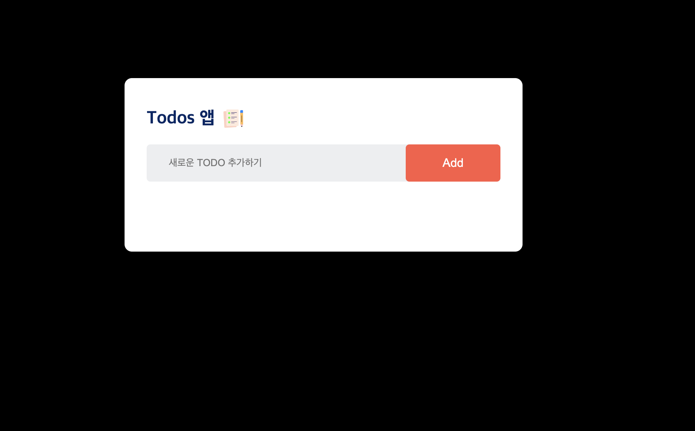
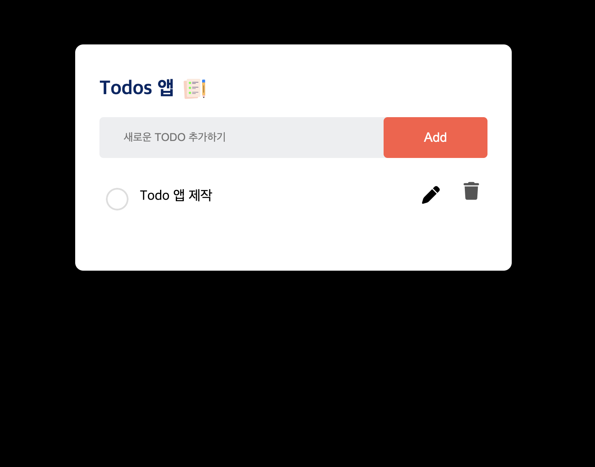
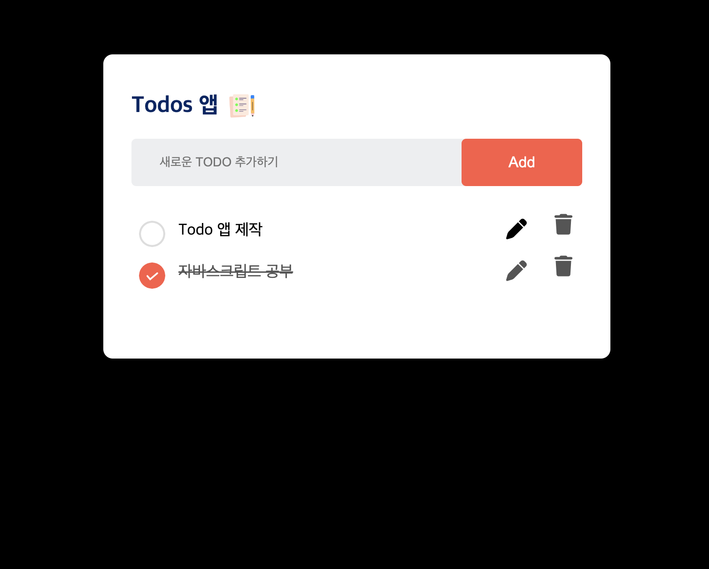
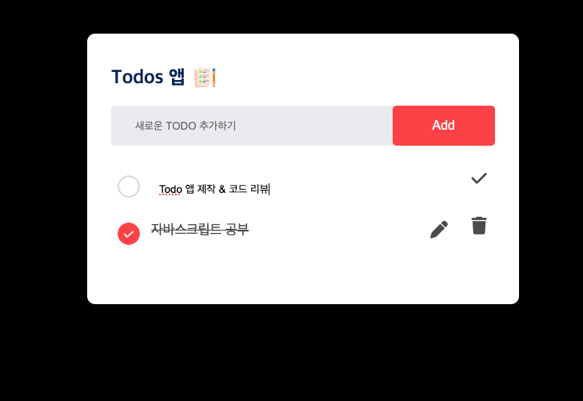
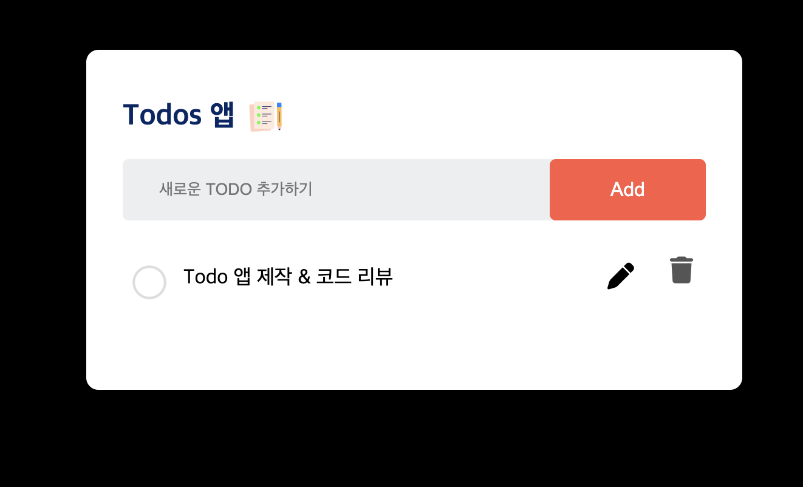

# 기능구현

1. 리스트 추가 기능

    - 값 입력 후 Add버튼 클릭
    - function addTask() 함수 이용 
    - inputBox가 빈 값이면 경고 메세지 
2. 리스트 체크 기능

    - click 이벤트 & toggle() 이용하여 on/off

3. 리스트 수정 기능

    - 수정 버튼(펜 아이콘) 누르면 리스트 수정 가능 -> 체크 아이콘으로 저장
    - 수정을 위한 입력 필드(editInput) 사용
    - 수정된 내용을 업데이트 하는 방식으로 수정

4. 리스트 삭제 기능

    - 휴지통 아이콘으로 삭제 가능
    - addRemoveBtn() -> 삭제 버튼 생성
    - click 이벤트 이용하여 리스트 삭제

5. Local Storage 사용
    - saveDate() -> 리스트 목록을 로컬 스토리지에 저장
    - showTask() -> 페이지가 로드될 때 로컬 스토리지에서 데이터를 가져와서 리스트 표시